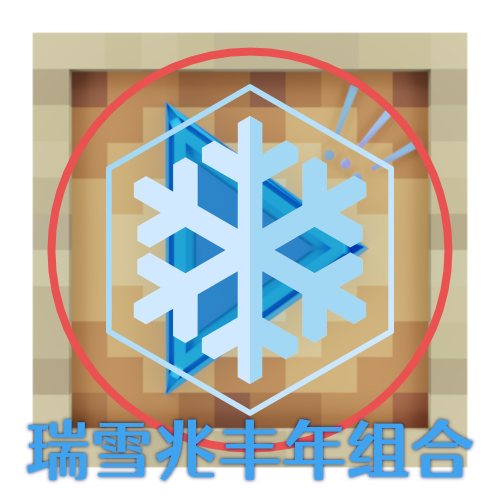

<h1 style="text-align: center;"> {local_description} </h1>

<h2>  &nbsp; {liteyuki_name} - 睿乐 </h2>

 - 灵温 {liteyuki_version} | Nonebot {liteyuki_nonebot}
 - {liteyuki_system} {liteyuki_python}
 - {local_plugins}{liteyuki_plugins} | {local_resources}{liteyuki_resources}
 - {local_bots}{liteyuki_bots}
 - {local_runtime}{liteyuki_runtime}

### **{bot_name} &nbsp;|&nbsp; **

 - {bot_app_name} : {bot_protocol_name}
 - {local_groups}{bot_groups} | {local_friends}{bot_friends} | {local_message_sent}{bot_message_sent} | {local_message_received}{bot_message_received}

## {local_cpu} : {hardware_cpu_percent}%

 - {hardware_cpu_name} | {hardware_cpu_cores}{local_cores} {hardware_cpu_threads}{local_threads} | {hardware_cpu_freq}{local_units_GHz}

## {local_memory} : {hardware_memory_percent}%

 - {local_process} {hardware_memory_processmem}
 - {local_used} {hardware_memory_usedmem}
 - {local_free} {hardware_memory_freemem}
 - {local_total} {hardware_memory_totalmem}

## {local_swap} : {hardware_swap_percent}%

 - {local_used} {hardware_swap_usedswap}
 - {local_free} {hardware_swap_freeswap}
 - {local_total} {hardware_swap_totalswap}

## {local_disk}

 - {hardware_disk_name} - {local_used} {hardware_disk_useddisk} | {hardware_disk_freedisk} | {local_total} {hardware_disk_totaldisk}

-----------------------

END.

### {motto_text}

——{motto_source}

#### 
{acknowledgement}

#### 
该页样式由 金羿Eilles 设计
